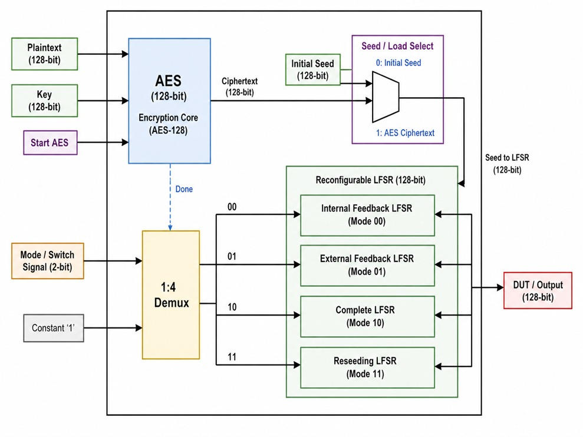
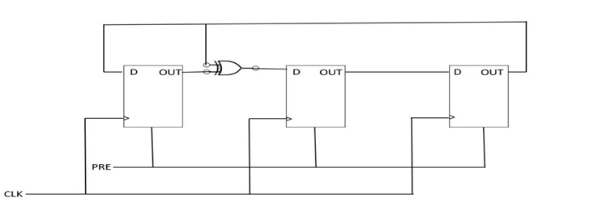
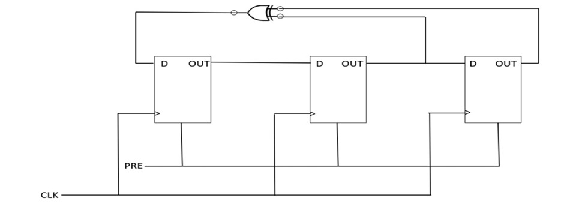
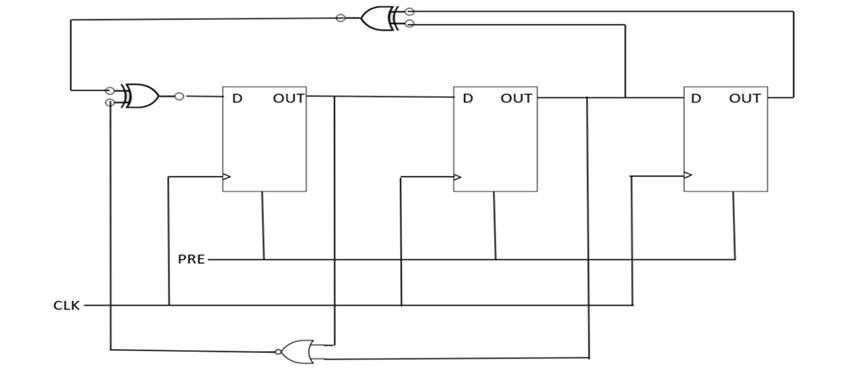
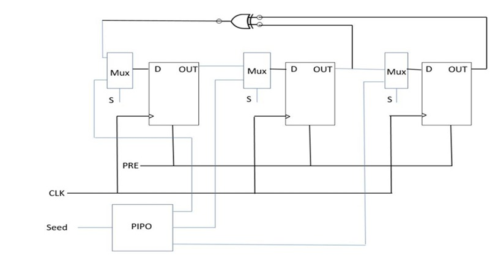

# AES Based Reconfigurable LFSR 

## Overview

This project implements a 128-bit AES encryption core integrated with a Reconfigurable LFSR.

The ciphertext generated by AES is used as a dynamic seed for the LFSR to improve randomness and security.

## Features

- AES-128 Encryption
- Internal Feedback LFSR
- External Feedback LFSR
- Complete LFSR
- Reseeding LFSR
- Dynamic Ciphertext Based Seeding

## Architecture

## Internal Feedback LFSR

## External Feedback LFSR

## Complete LFSR

## Reseeding LFSR

## Tools

- Verilog HDL
- ModelSim
- Quartus Prime

## Author

Deepthi
